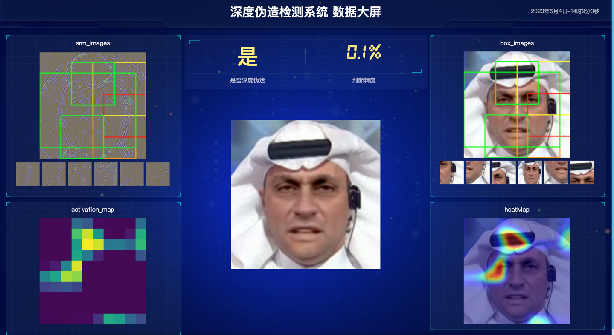
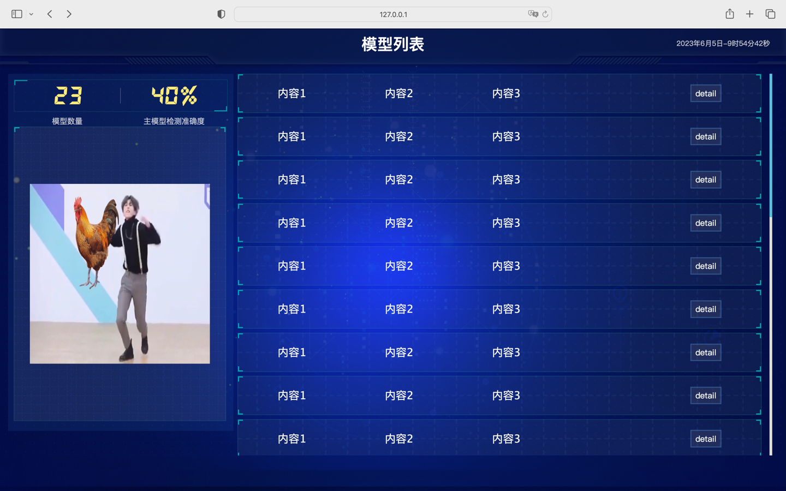

鉴于现在还没有拿到确切的后端接口，那么就暂且口胡一下


1.假设有一个上传按钮

2.点击上传按钮，就会上传一个什么玩意，然后页面跳转

3.跳转之后的页面中：

- 很显然，分为两部分，一部分显示图片和由图片造出来的图片，另一部分显示一些数据
- 具体怎么布局，那就不管了，瞎弄吧，反正美术课是信息老师教的。。。

update后的界面（可能比之前的界面多了些可以动的光点，布局上其实比较抽象）



# update in 6.5

添加menu界面：

路由为``/menu``

然后点击后跳转到具体模型页面

显示数据的接口在app.py的menu函数中:
```python
def menu():
    pic_route = "pic/demo.jpg"
    monk = [
        {"字段1": "内容1", "字段2": "内容2", "字段3": "内容3", "url": "'/main1'"},
        {"字段1": "内容1", "字段2": "内容2", "字段3": "内容3", "url": "'/main1'"},
        {"字段1": "内容1", "字段2": "内容2", "字段3": "内容3", "url": "'/main1'"},
        {"字段1": "内容1", "字段2": "内容2", "字段3": "内容3", "url": "'/main1'"},
        {"字段1": "内容1", "字段2": "内容2", "字段3": "内容3", "url": "'/main1'"},
        {"字段1": "内容1", "字段2": "内容2", "字段3": "内容3", "url": "'/main1'"},
        {"字段1": "内容1", "字段2": "内容2", "字段3": "内容3", "url": "'/main1'"},
        {"字段1": "内容1", "字段2": "内容2", "字段3": "内容3", "url": "'/main1'"},
        {"字段1": "内容1", "字段2": "内容2", "字段3": "内容3", "url": "'/main1'"},
        {"字段1": "内容1", "字段2": "内容2", "字段3": "内容3", "url": "'/main1'"},
        {"字段1": "内容1", "字段2": "内容2", "字段3": "内容3", "url": "'/main1'"},
        {"字段1": "内容1", "字段2": "内容2", "字段3": "内容3", "url": "'/main1'"},
        {"字段1": "内容1", "字段2": "内容2", "字段3": "内容3", "url": "'/main1'"},
        {"字段1": "内容1", "字段2": "内容2", "字段3": "内容3", "url": "'/main1'"},
        {"字段1": "内容1", "字段2": "内容2", "字段3": "内容3", "url": "'/main1'"},
        {"字段1": "内容1", "字段2": "内容2", "字段3": "内容3", "url": "'/main1'"},
        {"字段1": "内容1", "字段2": "内容2", "字段3": "内容3", "url": "'/main1'"},
        {"字段1": "内容1", "字段2": "内容2", "字段3": "内容3", "url": "'/main1'"},
        {"字段1": "内容1", "字段2": "内容2", "字段3": "内容3", "url": "'/main1'"},
        {"字段1": "内容1", "字段2": "内容2", "字段3": "内容3", "url": "'/main1'"},
        {"字段1": "内容1", "字段2": "内容2", "字段3": "内容3", "url": "'/main1'"},
        {"字段1": "内容1", "字段2": "内容2", "字段3": "内容3", "url": "'/main1'"},
        {"字段1": "内容1", "字段2": "内容2", "字段3": "内容3", "url": "'/main1'"},

    ]
    monk1 = [
        {"字段1": "内容1", "字段2": "内容2", "字段3": "内容3"},
        {"字段1": "内容1", "字段2": "内容2", "字段3": "内容3"},
    ]
    rate = 40
    data_used = monk
    return render_template('menu.html', data=data_used, pic_route=pic_route, data_len=len(data_used), percentage=rate)

```
可自行修改